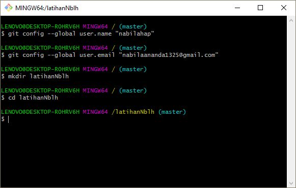
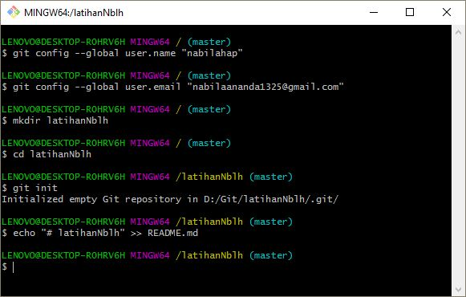
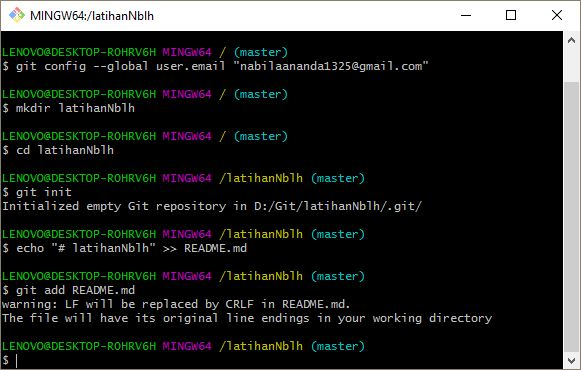
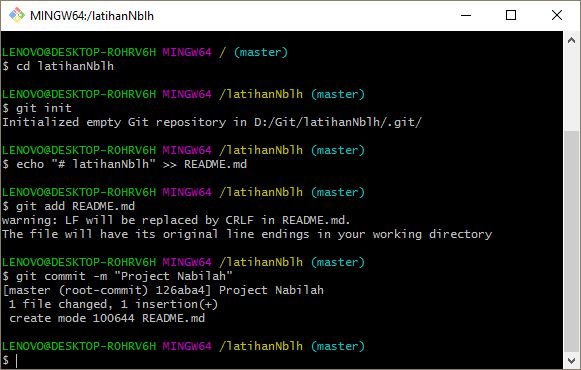
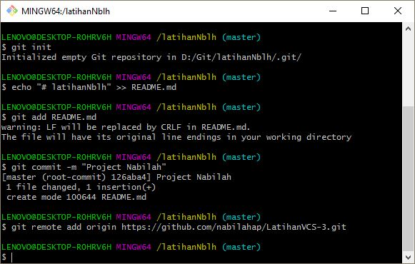
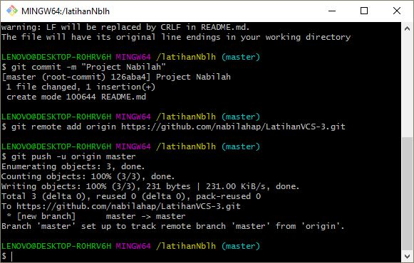

# latihanNblh

# Instalasi Git
Download git terlebih dahulu, di website resmi [Git](https://git-scm.com/download)
# Tutorial Penggunaan Git
- Pada saat pertama kali mnggunakan git, peru dilakukan konfigurasi user.name dan user.email.
- Config Global Repository
> git config --global user.name "nama_user"

> git config --global user.email "nama_user"

- Setelah itu, buat direktory project pertama.
> mkdir latihanNblh

> cd latihanNblh

- Kemudian jalankan perintah git init< untuk membuat repository local.
> git init

- Untuk membuat file dapat menggunakan text editor, lalu menyimpan filenya pada repository. Disini saya membuat contoh satu file bernama README.md.
> echo "# latihanNblh" >> README.md

- Kemudian, untuk menambahkan file yang baru saja dibuat tersebut gunakan perintah **git add**.
> git add README.md

- Setelah itu, untuk menyimpan perubahan yang ada kedalam database repository local, gunakan perintah **git commit -m "komentar commit"**.
> git commit -m "Project Nabilah"

- Untuk menambahkan remote repository server, gunakan perintah **git remote add origin [url]**.
> git remote add origin https://github.com/nabilahap/LatihanVCS-3.git

- Kemudian, untuk mengirim perubahan pada local repository ke server gunakan perintah git push.
> git push -u origin master

- Selesai

# TERIMA KASIH

